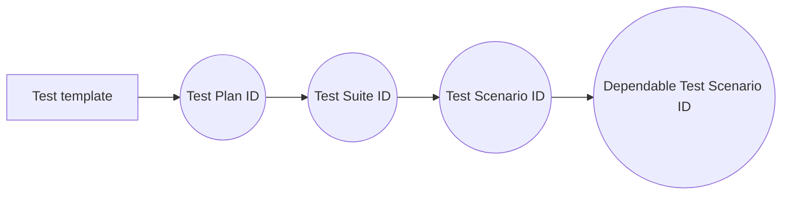

# test-template
This repository contains a test scenario template to import or export using any test management.

## Why?

- Today we have a bunch of test management, but we don’t have any way to easily export an entire test suite created using one test management to another one.

	> As we have infrastructure as a code (an easy way to easily migrate our infrastructure provider) we also could have a template for test scenarios. So for any reason any test management dies, we can use any other test management on the market.
	> 

Help us to figure out the best test temolate interface for the market, so they can consume or export using:

## Fields related to each step above

|                |Test Plan ID                                  |
|----------------|----------------------------------------------|
|testPlanId      |`'ID related to the test plan id'`            |
|testPlanName    |`'Test plan name'`                            |
|testPlanActive  |`'Test plan status'`                          |

|                |Test Suite ID                                 |
|----------------|----------------------------------------------|
|testSuiteId      |`'ID related to the test suite id'`          |
|testSuiteName    |`'Test suite name'`                          |
|testSuiteActive  |`'Test suite status'`                        |

|                |Test Scenario ID                              |
|----------------|----------------------------------------------|
|testScenarioId      |`'ID related to the test scenario id'`    |
|testScenarioName    |`'Test scenario name'`                    |
|testScenarioActive  |`'Test scenario status'`                  |

|                |Dependable Test Scenario ID                                 |
|----------------|------------------------------------------------------------|
|dependableTestScenarioId      |`'ID related to the dependable test scenario'`|
|dependableTestScenarioName    |`'Dependable Test scenarios name'`            |
|dependableTestScenarioActive  |`'Dependable Test scenarios status'`          |
